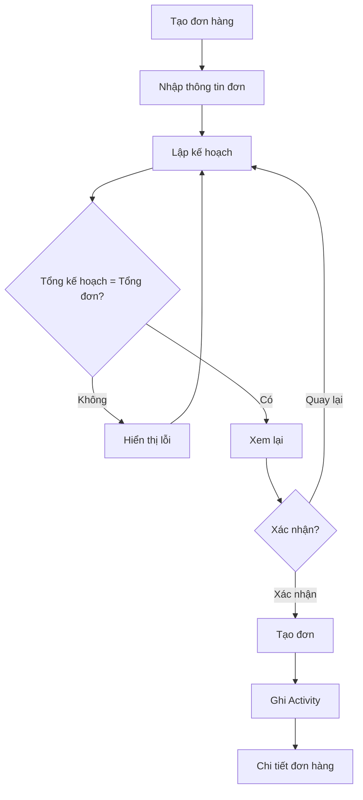
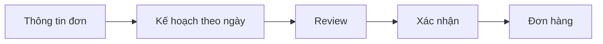

# Production Management Web App
# Screen Specification: Create Order + Production Plan

## 1. Mục đích

Màn hình này cho phép quản lý tạo một đơn hàng hoàn chỉnh ngay từ đầu:

> Nhập thông tin đơn → Lập kế hoạch theo ngày → Kiểm tra → Xem lại → Xác nhận tạo.

Không tạo một đơn hàng "trống kế hoạch" trong flow thông thường.

Sau khi tạo thành công, hệ thống chuyển thẳng đến Chi tiết đơn hàng.

---

## 2. Thông tin đơn hàng

Bắt buộc:

- Mã đơn hàng.
- Tổng số lượng.
- Ngày bắt đầu.
- Hạn hoàn thành.

Ví dụ:

```text
┌─────────────────────────────────────────────┐
│ TẠO ĐƠN HÀNG                                │
│                                             │
│ Mã đơn hàng *                               │
│ [ ORD-001                                  ]│
│                                             │
│ Tổng số lượng *                             │
│ [ 1,000 ] đôi                               │
│                                             │
│ Ngày bắt đầu *                              │
│ [ 11/08/2026 ]                              │
│                                             │
│ Hạn hoàn thành *                            │
│ [ 15/08/2026 ]                              │
│                                             │
│                         [ Tiếp tục ]        │
└─────────────────────────────────────────────┘
```

---

## 3. Business Rules — thông tin đơn

### Mã đơn hàng

- Bắt buộc.
- Phải xác định được duy nhất một đơn hàng.
- Không được trùng mã đơn đang tồn tại.

### Tổng số lượng

- Bắt buộc.
- Phải lớn hơn 0.
- Chỉ nhận số nguyên.
- Không nhận số âm.
- Không nhận số thập phân.

Ví dụ:

```text
1000    ✓
1,000   ✓
0       ✗
-10     ✗
100.5   ✗
```

### Ngày

Quy tắc:

> Ngày bắt đầu <= Hạn hoàn thành

Không cho phép ngày bắt đầu sau deadline.

Số ngày sản xuất được tính:

> Deadline - Ngày bắt đầu + 1

Bao gồm cả ngày bắt đầu và deadline.

Ví dụ:

```text
11/08 → 15/08 = 5 ngày
```

---

## 4. Flow tổng thể

```text
Tạo đơn hàng
      ↓
Nhập thông tin đơn
      ↓
Lập kế hoạch
      ↓
Kiểm tra tổng kế hoạch
      ↓
Xem lại
      ↓
Xác nhận
      ↓
Tạo đơn
      ↓
Ghi Activity
      ↓
Chi tiết đơn hàng
```

---

## 5. Màn hình lập kế hoạch

Sau khi nhập thông tin đơn, người dùng chuyển sang bước lập kế hoạch.

Ví dụ:

```text
LẬP KẾ HOẠCH SẢN XUẤT

ORD-001
1,000 đôi
11/08/2026 → 15/08/2026

┌──────────┬──────────────┐
│ Ngày     │ Kế hoạch     │
├──────────┼──────────────┤
│ 11/08    │ [    100 ]   │
│ 12/08    │ [    120 ]   │
│ 13/08    │ [    200 ]   │
│ 14/08    │ [    250 ]   │
│ 15/08    │ [    330 ]   │
├──────────┼──────────────┤
│ Tổng     │    1,000     │
└──────────┴──────────────┘

Đã phân bổ: 1,000 / 1,000 ✓

[ Quay lại ] [ Xem lại ]
```

---

## 6. Business Rules — kế hoạch

### Tổng kế hoạch phải bằng tổng đơn hàng

Đây là rule bắt buộc.

Ví dụ:

```text
Tổng đơn:     1,000
Kế hoạch:       950
```

Không được xác nhận.

Thông báo:

> Bạn còn thiếu 50 đôi chưa được phân bổ.

Nếu:

```text
Tổng đơn:     1,000
Kế hoạch:     1,050
```

Không được xác nhận.

Thông báo:

> Tổng kế hoạch vượt quá số lượng đơn hàng 50 đôi.

### Không bắt buộc chia đều

Quản lý tự quyết định sản lượng từng ngày.

Ví dụ hợp lệ:

```text
100
120
200
250
330
```

hoặc:

```text
200
200
200
200
200
```

hoặc:

```text
50
100
250
300
300
```

Miễn tổng bằng tổng đơn hàng.

### Cho phép kế hoạch ngày = 0

Có thể có ngày không sản xuất.

Ví dụ:

```text
11/08    200
12/08      0
13/08    300
14/08    200
15/08    300
```

Tổng vẫn phải bằng tổng đơn hàng.

### Ngày cuối có kế hoạch = 0

Vẫn hợp lệ về mặt nghiệp vụ.

Tuy nhiên hệ thống nên cảnh báo để quản lý xác nhận:

> Ngày hoàn thành đang có kế hoạch 0 đôi. Bạn có chắc muốn tiếp tục?

Không biến thành lỗi cứng vì quản lý có thể hoàn thành đơn trước deadline.

---

## 7. Review trước khi tạo

Nút `Xem lại` mở bước review.

```text
XÁC NHẬN TẠO ĐƠN

Mã đơn
ORD-001

Tổng số lượng
1,000 đôi

Thời gian
11/08/2026 → 15/08/2026

Kế hoạch

11/08     100
12/08     120
13/08     200
14/08     250
15/08     330
----------------
Tổng    1,000 ✓

Người tạo
Nguyễn Văn A

[ Quay lại ]       [ Xác nhận tạo đơn ]
```

Mục đích của bước review:

- Cho người dùng kiểm tra lại.
- Tránh tạo sai đơn.
- Đảm bảo tổng kế hoạch chính xác.
- Xác nhận người thực hiện.

---

## 8. Khi xác nhận tạo

Hệ thống thực hiện:

1. Tạo đơn hàng.
2. Tạo kế hoạch sản xuất theo ngày.
3. Ghi nhận user tạo.
4. Ghi Activity History.

Ví dụ Activity:

```text
👤 Nguyễn Văn A
11/08/2026 08:30

Tạo đơn hàng
ORD-001 — 1,000 đôi

Kế hoạch:
11/08: 100
12/08: 120
13/08: 200
14/08: 250
15/08: 330
```

---

## 9. Sau khi tạo thành công

Không quay về Danh sách đơn hàng.

Chuyển thẳng đến:

> Chi tiết đơn hàng.

Hiển thị thông báo:

> ✓ Tạo đơn hàng ORD-001 thành công.

Lý do:

- Người dùng vừa tạo đơn và thường muốn kiểm tra ngay.
- Giảm thêm một bước navigation.
- Có thể nhìn ngay kế hoạch và tiến độ ban đầu.

---

## 10. Thay đổi kế hoạch sau khi tạo

Sau khi đơn được tạo, quản lý vẫn có thể điều chỉnh kế hoạch.

Ví dụ:

```text
13/08: 200 → 180
14/08: 250 → 270
```

Tổng vẫn phải bằng tổng số lượng đơn hàng.

Mọi thay đổi phải:

- Có user thực hiện.
- Có thời gian.
- Có giá trị trước.
- Có giá trị sau.
- Có lý do.
- Có Activity History.

---

## 11. Phân biệt hai nghiệp vụ điều chỉnh kế hoạch

### 11.1. Điều chỉnh kế hoạch bình thường

Quản lý chủ động thay đổi kế hoạch.

Ví dụ:

```text
13/08: 200 → 180
```

Không nhất thiết liên quan đến sản lượng thiếu.

Activity phải thể hiện rõ:

> Điều chỉnh kế hoạch.

### 11.2. Bù sản lượng

Hệ thống phát hiện sản lượng thiếu.

Ví dụ:

```text
Thiếu 20 đôi
```

Quản lý chọn:

```text
13/08 +20
```

Activity phải thể hiện:

> Bù sản lượng thiếu 20 đôi.

Không ghi chung chung thành "Điều chỉnh kế hoạch".

---

## 12. Mermaid — Flow tạo đơn



---

## 13. Mermaid — cấu trúc flow



---

## 14. Trạng thái cần thiết

UI cần tính đến:

1. Form trống.
2. Form đang nhập.
3. Dữ liệu không hợp lệ.
4. Mã đơn bị trùng.
5. Ngày không hợp lệ.
6. Tổng kế hoạch nhỏ hơn tổng đơn.
7. Tổng kế hoạch lớn hơn tổng đơn.
8. Tổng kế hoạch chính xác.
9. Đang xác nhận tạo đơn.
10. Tạo thành công.
11. Tạo thất bại.

---

## 15. Tiêu chí hoàn thành

Flow đạt yêu cầu khi quản lý có thể:

1. Nhập mã đơn.
2. Nhập tổng số lượng.
3. Chọn ngày bắt đầu.
4. Chọn deadline.
5. Xem số ngày sản xuất.
6. Phân bổ sản lượng theo từng ngày.
7. Không thể xác nhận nếu tổng kế hoạch khác tổng đơn.
8. Có thể để một số ngày = 0.
9. Review trước khi tạo.
10. Xác nhận tạo đơn.
11. Hệ thống ghi user tạo.
12. Hệ thống tạo Activity History.
13. Sau khi tạo chuyển tới Chi tiết đơn hàng.

---

## 16. Ngoài phạm vi

Không xử lý trong flow này:

- Mẫu giày.
- Size.
- Màu.
- Nguyên vật liệu.
- Công đoạn sản xuất.
- Nhân công.
- Máy móc.
- Kho.
- Chi phí.
- ERP.

---

## 17. Nguyên tắc UX

- Một flow liền mạch.
- Không tạo đơn hàng thiếu kế hoạch trong flow chuẩn.
- Không tự động chia kế hoạch.
- Quản lý tự quyết định sản lượng từng ngày.
- Hệ thống kiểm tra tổng số lượng.
- Có bước Review trước khi xác nhận.
- Không tự động thay đổi kế hoạch.
- Phân biệt rõ "Điều chỉnh kế hoạch" và "Bù sản lượng".
- Mọi thay đổi quan trọng đều có user và Activity History.
