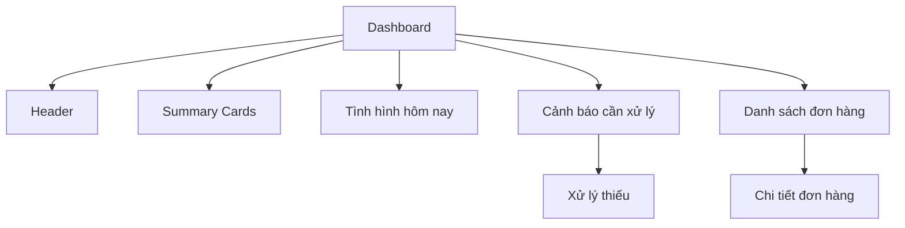
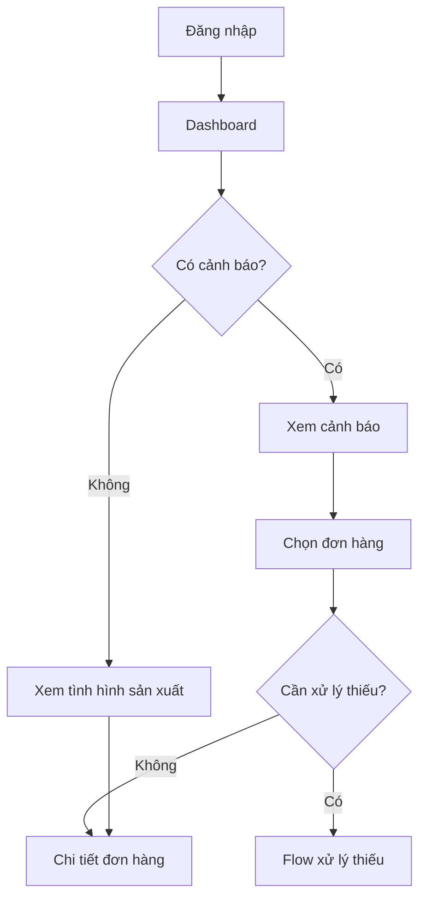

# Production Management Web App
# Screen Specification: Dashboard

## 1. Mục đích

Dashboard là màn hình đầu tiên sau khi đăng nhập, giúp quản lý nhìn nhanh tình hình sản xuất và xác định ngay các vấn đề cần xử lý.

Mục tiêu chính:

- Biết có bao nhiêu đơn đang theo dõi.
- Biết đơn nào đang chậm.
- Biết hôm nay cần sản xuất bao nhiêu.
- Biết hôm nay đã hoàn thành bao nhiêu.
- Biết còn thiếu bao nhiêu so với kế hoạch.
- Biết tổng sản lượng đã hoàn thành và còn lại.
- Có thể đi thẳng tới thao tác xử lý khi phát sinh thiếu sản lượng.

Dashboard không phải màn hình báo cáo chi tiết. Ưu tiên "nhìn → hiểu → hành động".

---

## 2. Đối tượng sử dụng

### Giai đoạn 1

- 1 quản lý.

### Tương lai

- Quản lý.
- Nhân viên nhập liệu.
- Có thể mở rộng thêm quyền theo vai trò.

Dashboard phải hiển thị user đang đăng nhập để phù hợp với mô hình nhiều tài khoản trong tương lai.

---

## 3. Navigation

Sidebar tối giản:

```text
Production Management

📊 Dashboard
📦 Đơn hàng
📝 Nhập sản lượng

----------------
⚙ Cài đặt
```

Dashboard là màn hình mặc định sau khi đăng nhập.

Header hiển thị:

- Tên màn hình: Dashboard.
- Ngày hiện tại.
- Tài khoản đang đăng nhập.

Ví dụ:

```text
Production Management

Dashboard                              11/08/2026
                                       👤 Nguyễn Văn A
```

---

## 4. Cấu trúc màn hình

Dashboard gồm 4 khu vực chính:

1. Summary Cards.
2. Tình hình sản xuất hôm nay.
3. Cảnh báo cần xử lý.
4. Danh sách đơn hàng đang theo dõi.

---

## 5. Summary Cards

Đề xuất 5 chỉ số:

| Card | Ý nghĩa |
|---|---|
| Đơn đang chạy | Số đơn chưa hoàn thành |
| Đang chậm | Số đơn đang chậm tiến độ |
| Hoàn thành | Số đơn đã hoàn thành |
| Đã hoàn thành | Tổng số đôi đã sản xuất |
| Còn lại | Tổng số đôi chưa hoàn thành |

Ví dụ:

```text
┌──────────────┐ ┌──────────────┐ ┌──────────────┐
│ Đơn đang chạy│ │ Đang chậm    │ │ Hoàn thành   │
│      3       │ │      1       │ │      4       │
└──────────────┘ └──────────────┘ └──────────────┘

┌──────────────┐ ┌──────────────┐
│ Đã hoàn thành│ │ Còn lại      │
│   2,380 đôi  │ │   1,620 đôi  │
└──────────────┘ └──────────────┘
```

### Quy tắc

- Không dùng màu chỉ để trang trí.
- Màu trạng thái phải có ý nghĩa.
- Đơn chậm: màu cảnh báo.
- Hoàn thành: màu xác nhận.
- Không có dữ liệu: trạng thái trung tính.

---

## 6. Khu vực "Hôm nay"

Đây là khu vực quan trọng nhất trên Dashboard.

Phải trả lời:

- Hôm nay cần sản xuất bao nhiêu?
- Đã hoàn thành bao nhiêu?
- Chênh lệch bao nhiêu?
- Tỷ lệ hoàn thành kế hoạch hôm nay là bao nhiêu?

Ví dụ:

```text
┌─────────────────────────────────────────────────────┐
│ HÔM NAY                                              │
│                                                     │
│ Cần sản xuất       Đã hoàn thành       Chênh lệch  │
│                                                     │
│    420 đôi             380 đôi             -40      │
│                                                     │
│ ██████████████████░░░░░░░░░░░░░░                   │
│                                                     │
│                  90.5% kế hoạch                     │
└─────────────────────────────────────────────────────┘
```

Nếu chưa nhập sản lượng:

```text
Cần sản xuất: 420 đôi
Đã hoàn thành: 0 đôi
Trạng thái: Chưa nhập
```

Không nên hiển thị giá trị âm theo cách khiến người dùng hiểu đó là lỗi dữ liệu.

---

## 7. Cảnh báo cần xử lý

Nếu có đơn chậm, cảnh báo phải được đặt ở vị trí dễ thấy.

Ví dụ:

```text
┌─────────────────────────────────────────────────────┐
│ ⚠ CẦN XỬ LÝ                                         │
│                                                     │
│ 🔴 ORD-001                                          │
│ Thiếu 40 đôi so với kế hoạch hôm nay                │
│ Còn 3 ngày đến hạn                                  │
│                                                     │
│                         [ Xử lý thiếu ]             │
└─────────────────────────────────────────────────────┘
```

### Hành vi

Click "Xử lý thiếu" → mở flow xử lý sản lượng thiếu.

Không bắt người dùng tự tìm đơn hàng rồi mới tìm thao tác xử lý.

Nếu có nhiều cảnh báo:

- Hiển thị danh sách.
- Ưu tiên đơn có mức độ nghiêm trọng cao hơn.
- Có thể click từng đơn để mở chi tiết.

---

## 8. Danh sách đơn hàng đang theo dõi

Hiển thị tổng quan các đơn chưa hoàn thành và các đơn gần đây/đáng chú ý.

Thông tin chính:

- Mã đơn.
- Tiến độ tổng thể.
- Tình hình hôm nay.
- Số lượng còn lại.
- Tình trạng.

Ví dụ:

```text
ĐƠN HÀNG ĐANG THEO DÕI

┌────────┬────────────┬──────────┬────────┬──────────┐
│ Mã đơn │ Tiến độ    │ Hôm nay  │ Còn lại│ Tình trạng│
├────────┼────────────┼──────────┼────────┼──────────┤
│ORD-001 │ 76%        │ -40      │ 240    │ 🔴 Chậm  │
│        │███████░░░  │          │        │          │
├────────┼────────────┼──────────┼────────┼──────────┤
│ORD-002 │ 100%       │ ✓        │ 0      │ ✓ Xong   │
│        │██████████  │          │        │          │
├────────┼────────────┼──────────┼────────┼──────────┤
│ORD-003 │ 60%        │ +10      │ 200    │ 🟢 Đúng  │
│        │██████░░░░  │          │        │          │
└────────┴────────────┴──────────┴────────┴──────────┘
```

Click một đơn → mở Chi tiết đơn hàng.

---

## 9. Trạng thái tiến độ

Dashboard sử dụng các trạng thái nghiệp vụ sau:

### Đúng tiến độ

Sản lượng lũy kế thực tế không thấp hơn mức cần đạt theo kế hoạch.

Hiển thị theo hướng tích cực.

### Chậm tiến độ

Sản lượng lũy kế thực tế thấp hơn mức cần đạt theo kế hoạch.

Phải hiển thị rõ số lượng đang thiếu.

Ví dụ:

> Chậm 40 đôi.

### Hoàn thành

Tổng sản lượng thực tế đạt đúng tổng số lượng đơn hàng.

Đơn chuyển sang trạng thái "Hoàn thành".

---

## 10. Quy tắc tính toán liên quan Dashboard

Dashboard không tự nhập hoặc tự sửa kế hoạch.

Các giá trị được lấy/tính từ dữ liệu đơn hàng và kế hoạch sản xuất:

- Tổng số lượng đơn.
- Kế hoạch ngày.
- Kế hoạch lũy kế.
- Thực tế ngày.
- Thực tế lũy kế.
- Số lượng còn lại.
- Số ngày còn lại.
- Chênh lệch kế hoạch/thực tế.
- Trạng thái tiến độ.

Kế hoạch đã điều chỉnh phải sử dụng kế hoạch cuối cùng sau khi các add-on đã được quản lý xác nhận.

Dashboard không tự động thay đổi kế hoạch.

---

## 11. UX Principles

### Ưu tiên thông tin quan trọng

Thứ tự ưu tiên:

1. Cảnh báo.
2. Tình hình hôm nay.
3. Đơn hàng đang gặp vấn đề.
4. Các thống kê tổng quan.

### Không yêu cầu người dùng tự tính toán

Ví dụ không chỉ hiển thị:

> Kế hoạch lũy kế: 420  
> Thực tế lũy kế: 380

Mà phải giúp người dùng hiểu:

> 🔴 Chậm 40 đôi.

### Không tự quyết định thay quản lý

Dashboard chỉ:

- Phát hiện.
- Tính toán.
- Cảnh báo.
- Đưa ra hành động.

Không tự động điều chỉnh kế hoạch.

---

## 12. User / Audit

Dashboard hiển thị tài khoản đang đăng nhập.

Mọi thao tác thay đổi dữ liệu được thực hiện từ Dashboard hoặc các màn hình khác phải gắn với user tương ứng trong Activity/Audit History.

Ví dụ:

```text
👤 Nguyễn Văn A
11/08/2026 18:30
Điều chỉnh kế hoạch ORD-001
```

Dashboard không cần hiển thị toàn bộ audit log; audit chi tiết nằm trong Chi tiết đơn hàng → Lịch sử hoạt động.

---

## 13. Mermaid — cấu trúc Dashboard



---

## 14. Mermaid — user flow



---

## 15. Các thao tác từ Dashboard

| Thao tác | Kết quả |
|---|---|
| Click Dashboard | Không chuyển trang |
| Click đơn hàng | Mở Chi tiết đơn hàng |
| Click "Xử lý thiếu" | Mở flow xử lý thiếu |
| Click "Nhập sản lượng" | Mở màn hình Nhập sản lượng |
| Click user | Mở menu tài khoản |
| Click Đơn hàng | Mở Danh sách đơn hàng |

---

## 16. Không thuộc phạm vi Dashboard

Không đưa vào Dashboard giai đoạn đầu:

- Biểu đồ phân tích sản xuất phức tạp.
- Báo cáo theo tháng/quý.
- Export Excel.
- Phân tích hiệu suất nhân viên.
- Quản lý nguyên vật liệu.
- Quản lý mẫu/size/màu giày.
- Quản lý máy móc.
- Quản lý kho.
- ERP.

Những chức năng này có thể được xem xét khi nhu cầu thực tế phát sinh.

---

## 17. Tiêu chí hoàn thành màn hình

Dashboard được xem là đạt yêu cầu khi người dùng có thể mở màn hình và trong vài giây trả lời được:

1. Có bao nhiêu đơn đang chạy?
2. Có đơn nào đang chậm không?
3. Nếu chậm thì chậm bao nhiêu?
4. Hôm nay cần sản xuất bao nhiêu?
5. Hôm nay đã sản xuất bao nhiêu?
6. Còn bao nhiêu sản lượng?
7. Tôi cần xử lý vấn đề nào ngay bây giờ?

Nếu người dùng phải đi vào nhiều màn hình mới trả lời được các câu hỏi trên thì Dashboard chưa đạt mục tiêu.
