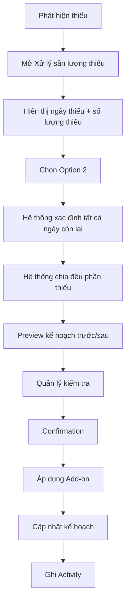
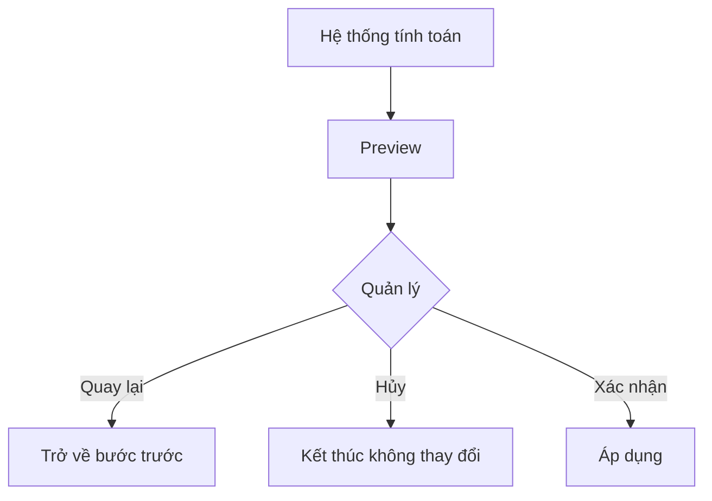

# Màn hình 6 — Xử lý sản lượng thiếu — Option 2: Hệ thống đề xuất chia đều

## 1. Mục đích

Màn hình cho phép quản lý xử lý phần sản lượng bị thiếu bằng cách để hệ thống tự động chia đều toàn bộ số lượng thiếu cho tất cả các ngày sản xuất còn lại của đơn hàng.

Mục tiêu:

- Hiển thị rõ ngày phát sinh thiếu.
- Hiển thị chính xác số lượng cần bù.
- Hệ thống tự xác định các ngày còn lại để nhận phần bù.
- Hệ thống tự động chia đều toàn bộ số lượng thiếu.
- Nếu không chia hết, phần dư được phân bổ từ ngày gần nhất trở đi.
- Hiển thị preview kế hoạch trước/sau khi bù.
- Không cho người dùng chỉnh số lượng Add-on.
- Chỉ áp dụng thay đổi sau khi quản lý xác nhận.
- Ghi Activity cho thao tác bù sản lượng.
- Không tự động giảm kế hoạch của bất kỳ ngày nào khác.

---

## 2. Đối tượng sử dụng

### Giai đoạn 1

- 01 quản lý.
- Sử dụng trên máy tính.
- Có network/internet.

### Tương lai

Có thể mở rộng cho nhân viên và phân quyền.

---

## 3. UI / Layout

Màn hình gồm các khu vực:

1. Thông tin sản lượng thiếu.
2. Thông tin phương thức xử lý — Option 2.
3. Thông tin hệ thống đề xuất.
4. Preview kế hoạch trước/sau khi bù.
5. Confirmation.
6. Kết quả sau khi áp dụng.

### 3.1 Thông tin sản lượng thiếu

Hiển thị rõ:

- Ngày phát sinh thiếu.
- Kế hoạch của ngày đó.
- Thực tế của ngày đó.
- Số lượng thiếu.

Ví dụ:

```text
Ngày thiếu:       11/08/2026
Kế hoạch:         100 đôi
Thực tế:           80 đôi
Số lượng cần bù:   20 đôi
```

### 3.2 Phương thức xử lý

Hiển thị rõ đây là Option 2:

```text
Phương thức xử lý

Hệ thống đề xuất chia đều

Hệ thống sẽ tự động chia toàn bộ số lượng thiếu
cho các ngày sản xuất còn lại của đơn hàng.
```

Không yêu cầu quản lý chọn ngày.

### 3.3 Các ngày nhận bù

Hệ thống tự động lấy:

> Tất cả các ngày sản xuất còn lại sau ngày phát sinh thiếu.

Không giới hạn số lượng ngày.

Ví dụ:

```text
Ngày thiếu: 11/08

Các ngày còn lại:
12/08
13/08
14/08
15/08
...
20/08
```

Ngày 11/08 không tham gia nhận Add-on.

### 3.4 Không nhập số lượng bù

Người dùng không nhập số lượng bù.

Nếu hệ thống xác định thiếu 20 đôi:

> Option 2 luôn phân bổ đủ 20 đôi.

Không cho người dùng thay đổi số lượng Add-on được hệ thống đề xuất.

Lý do:

Option 2 là nghiệp vụ để hệ thống tự động chia đều toàn bộ phần thiếu, không phải nghiệp vụ cho phép quản lý tự phân bổ số lượng.

---

## 4. Business Rules

### 4.1 Bù toàn bộ số lượng thiếu

Nếu:

```text
Kế hoạch: 100
Thực tế: 80
Thiếu: 20
```

thì Option 2 phải phân bổ:

> Tổng Add-on = +20 đôi.

Không cho xử lý một phần thiếu.

### 4.2 Xác định ngày nhận bù

Hệ thống tự động lấy:

> Toàn bộ các ngày sản xuất còn lại của đơn hàng sau ngày phát sinh thiếu.

Ví dụ:

```text
Ngày thiếu: 11/08

12/08
13/08
14/08
15/08
16/08
...
20/08
```

Tất cả các ngày trên đều tham gia chia phần thiếu.

Không có giới hạn cố định như 3 ngày hoặc 5 ngày.

### 4.3 Ngày phát sinh thiếu không nhận Add-on

Ngày phát sinh thiếu không được đưa vào danh sách ngày nhận bù.

Ví dụ:

```text
11/08
KH = 100
TT = 80
Thiếu = 20
```

→ 11/08 không nhận Add-on.

### 4.4 Chia đều phần thiếu

Hệ thống chia toàn bộ số lượng thiếu cho tất cả các ngày sản xuất còn lại.

Ví dụ:

```text
Thiếu = 20
Số ngày còn lại = 4
```

Kết quả:

```text
12/08  +5
13/08  +5
14/08  +5
15/08  +5
```

### 4.5 Trường hợp không chia hết

Nếu số lượng thiếu không chia hết cho số ngày còn lại, hệ thống vẫn phải đảm bảo:

> Tổng Add-on = đúng số lượng thiếu.

Ví dụ:

```text
Thiếu = 10
Số ngày còn lại = 3
```

Kết quả:

```text
12/08  +4
13/08  +3
14/08  +3
```

Rule:

> Phần dư được cộng lần lượt từ ngày gần nhất trở đi.

Ví dụ:

```text
Thiếu = 11
3 ngày còn lại
```

→

```text
12/08  +4
13/08  +4
14/08  +3
```

### 4.6 Không cho chỉnh Add-on

Người dùng không được:

- Thay đổi số lượng Add-on.
- Chọn lại ngày nhận bù.
- Xóa một ngày khỏi danh sách nhận bù.
- Thêm một ngày khác vào danh sách nhận bù.

Danh sách ngày và số lượng Add-on là kết quả do hệ thống tính toán.

### 4.7 Add-on

Ví dụ:

```text
11/08
KH: 100
TT: 80
Thiếu: 20

12/08
KH hiện tại: 120
Add-on: +5
KH cuối: 125

13/08
KH hiện tại: 200
Add-on: +5
KH cuối: 205

14/08
KH hiện tại: 250
Add-on: +5
KH cuối: 255

15/08
KH hiện tại: 330
Add-on: +5
KH cuối: 335
```

Chỉ các ngày còn lại nhận Add-on.

Không giảm kế hoạch của bất kỳ ngày nào.

### 4.8 Tổng đơn không thay đổi

Bù sản lượng không làm tăng số lượng của đơn hàng.

Ví dụ:

```text
Tổng đơn: 1.000 đôi
```

vẫn là:

> 1.000 đôi.

Add-on chỉ thể hiện phần kế hoạch được cộng thêm để bù sản lượng thiếu.

### 4.9 Tổng kế hoạch sau bù

Kế hoạch ban đầu có tổng bằng tổng đơn.

Sau khi bù:

> Tổng kế hoạch cuối có thể lớn hơn tổng số lượng đơn.

Ví dụ:

```text
Tổng đơn:       1.000
KH ban đầu:     1.000
Add-on:            20
KH cuối:         1.020
```

`1.020` không có nghĩa đơn hàng tăng thành 1.020.

Nó chỉ phản ánh tổng kế hoạch sau các lần Add-on.

### 4.10 Tổng thực tế

Tổng thực tế tuyệt đối không được vượt tổng số lượng đơn.

Ví dụ:

```text
Tổng đơn:       1.000
Tổng thực tế:   1.000
```

→ Đơn hoàn thành.

Không được nhập thêm.

Đây là giới hạn cứng của sản lượng thực tế.

### 4.11 Phân biệt Bù sản lượng và Điều chỉnh kế hoạch

Bù sản lượng:

- Xuất phát từ thiếu sản lượng.
- Có nguồn từ một ngày thiếu.
- Có Add-on.
- Option 2 do hệ thống tự phân bổ.
- Không giảm kế hoạch ngày khác.
- Activity ghi rõ "Bù sản lượng thiếu".

Điều chỉnh kế hoạch:

- Là thay đổi kế hoạch chủ động.
- Là nghiệp vụ riêng.
- Không được ghi chung thành Bù sản lượng.

---

## 5. Preview kế hoạch

Không áp dụng ngay khi hệ thống tính toán.

Sau khi hệ thống xác định ngày nhận bù và số lượng Add-on, hiển thị preview:

```text
Kế hoạch trước và sau khi bù

Ngày       Hiện tại    Add-on    Sau khi bù
11/08        100          -          100
12/08        120         +5          125
13/08        200         +5          205
14/08        250         +5          255
15/08        330         +5          335
```

Chỉ các ngày sản xuất còn lại được thay đổi.

Ngày phát sinh thiếu không thay đổi.

Thông báo:

> Hệ thống sẽ chia đều 20 đôi cho 4 ngày sản xuất còn lại.

Nếu không chia hết, hiển thị rõ:

> Phần dư được phân bổ từ ngày gần nhất trở đi.

### 5.1 Summary

Hiển thị tổng quan:

```text
Tổng số lượng thiếu:    20 đôi
Tổng Add-on:            +20 đôi
Số ngày nhận bù:          4 ngày
```

Có thể hiển thị thêm:

```text
Tổng kế hoạch:
1.000 → 1.020 đôi
```

Kèm giải thích:

> Tổng đơn vẫn là 1.000 đôi. Add-on chỉ làm thay đổi kế hoạch sản xuất, không làm tăng số lượng đơn.

---

## 6. Confirmation

Không áp dụng ngay sau khi hệ thống tính toán.

Flow:

```text
Hệ thống tính toán
↓
Preview
↓
Quản lý kiểm tra
↓
Confirmation
↓
Áp dụng
```

Modal:

```text
Xác nhận bù sản lượng

Ngày thiếu: 11/08/2026
Số lượng thiếu: 20 đôi

Hệ thống sẽ chia đều cho 4 ngày còn lại:

12/08  +5
13/08  +5
14/08  +5
15/08  +5

Sau khi xác nhận, kế hoạch sẽ được cập nhật.

[Quay lại] [Xác nhận bù]
```

Chỉ sau khi quản lý xác nhận mới cập nhật kế hoạch.

Không cần và không cho phép chỉnh số lượng trong modal confirmation.

---

## 7. User Flow

### 7.1 Bù sản lượng



### 7.2 Hủy thao tác



---

## 8. Các trạng thái UI

### Loading

Hiển thị loading khi tải:

- Thông tin thiếu.
- Các ngày sản xuất còn lại.
- Kế hoạch hiện tại.
- Kết quả phân bổ Add-on.

### Loaded

Hiển thị đầy đủ dữ liệu và kết quả hệ thống đề xuất.

### Đang tính toán

Có thể hiển thị trạng thái:

```text
Đang tính toán phương án bù...
```

Trong trạng thái này không cho người dùng thao tác Apply.

### Có đề xuất

Hiển thị:

- Danh sách ngày nhận bù.
- Add-on từng ngày.
- Kế hoạch trước/sau.
- Summary.

Nút xác nhận được enable.

### Confirmation

Hiển thị modal xác nhận.

### Thành công

Hiển thị:

```text
✓ Đã xử lý sản lượng thiếu

20 đôi đã được phân bổ cho
4 ngày sản xuất còn lại.
```

Có thể hiển thị chi tiết:

```text
12/08: 120 → 125
13/08: 200 → 205
14/08: 250 → 255
15/08: 330 → 335
```

### Error

Không áp dụng thay đổi.

Hiển thị lỗi và cho phép thử lại.

---

## 9. Validation

### Số lượng thiếu

- Phải lớn hơn 0.
- Option 2 phải phân bổ toàn bộ số lượng thiếu.

### Ngày nhận bù

- Hệ thống phải xác định được các ngày sản xuất còn lại của đơn hàng.
- Ngày phát sinh thiếu không được nhận Add-on.
- Tất cả các ngày sản xuất còn lại đều phải được đưa vào phương án phân bổ.

### Phân bổ Add-on

- Tổng Add-on phải bằng chính xác số lượng thiếu.
- Add-on phải được chia đều theo số ngày còn lại.
- Nếu không chia hết, phần dư được phân bổ từ ngày gần nhất trở đi.
- Không cho người dùng chỉnh kết quả phân bổ.

### Khi xác nhận

Hệ thống phải kiểm tra lại dữ liệu trước khi áp dụng.

Không áp dụng nếu dữ liệu đã thay đổi khiến thao tác không còn hợp lệ.

### Tổng thực tế

Không được phép có bất kỳ thao tác bù nào dẫn tới tổng thực tế vượt tổng số lượng đơn.

---

## 10. Audit / User liên quan

Mỗi lần bù sản lượng phải ghi Activity.

Một lần xử lý Option 2 được ghi thành **01 Activity**, không tạo một Activity riêng cho từng ngày nhận Add-on.

Activity phải ghi:

- User thực hiện.
- Thời gian.
- Loại thao tác.
- Ngày phát sinh thiếu.
- Số lượng thiếu.
- Danh sách các ngày được bù.
- Kế hoạch trước của từng ngày.
- Add-on của từng ngày.
- Kế hoạch sau của từng ngày.

Ví dụ:

```text
11/08 18:30
Nguyễn Văn A

Bù sản lượng thiếu

Ngày thiếu: 11/08
Thiếu: 20 đôi

Hệ thống chia đều cho 4 ngày:

12/08   120 → 125
13/08   200 → 205
14/08   250 → 255
15/08   330 → 335
```

Activity không được xóa.

---

## 11. Tiêu chí hoàn thành

Màn hình được xem là hoàn thành khi:

- Hiển thị đúng ngày phát sinh thiếu.
- Hiển thị đúng số lượng thiếu.
- Không yêu cầu quản lý chọn ngày nhận bù.
- Hệ thống tự lấy toàn bộ các ngày sản xuất còn lại.
- Ngày phát sinh thiếu không nhận Add-on.
- Hệ thống tự chia đều toàn bộ số lượng thiếu.
- Nếu không chia hết, phần dư được phân bổ từ ngày gần nhất trở đi.
- Không cho người dùng nhập số lượng bù thủ công.
- Không cho người dùng chỉnh Add-on.
- Không cho người dùng thêm/xóa ngày nhận bù.
- Tổng Add-on đúng bằng số lượng thiếu.
- Chỉ các ngày còn lại nhận Add-on.
- Không giảm kế hoạch của các ngày khác.
- Tổng đơn không thay đổi.
- Tổng kế hoạch sau Add-on có thể lớn hơn tổng đơn.
- Tổng thực tế không bao giờ được vượt tổng đơn.
- Có preview trước khi áp dụng.
- Có confirmation.
- Chỉ áp dụng sau khi xác nhận.
- Ghi 01 Activity cho một lần xử lý bù.
- Activity chứa đầy đủ thay đổi của tất cả các ngày.
- Có trạng thái loading, calculating, success, error.
- Có thể hủy/quay lại mà không làm thay đổi dữ liệu.

---

## 12. Phạm vi

### In scope

- Hiển thị sản lượng thiếu.
- Tự động xác định các ngày sản xuất còn lại.
- Tự động chia đều số lượng thiếu.
- Phân bổ phần dư từ ngày gần nhất.
- Preview kế hoạch.
- Add-on.
- Confirmation.
- Áp dụng Add-on.
- Activity History.
- Validation.

### Out of scope

- Option 1 — Quản lý tự chọn ngày để bù.
- Điều chỉnh kế hoạch bình thường.
- Nhập sản lượng.
- Quản lý sản phẩm.
- Quản lý nhân viên/phân quyền.
- Các chức năng ERP khác.
- Chia theo năng lực/công suất từng ngày.
- Chia theo trọng số hoặc tỷ lệ.
- Cho phép quản lý chỉnh kết quả hệ thống đề xuất.

---

## 13. Quyết định nghiệp vụ đã chốt

1. Option 2 do hệ thống tự động phân bổ phần thiếu.
2. Option 2 bù toàn bộ số lượng thiếu.
3. Không cho người dùng nhập số lượng bù thủ công.
4. Không cho người dùng chọn ngày nhận bù.
5. Hệ thống sử dụng toàn bộ các ngày sản xuất còn lại sau ngày phát sinh thiếu.
6. Ngày phát sinh thiếu không nhận Add-on.
7. Hệ thống chia đều phần thiếu cho các ngày còn lại.
8. Nếu không chia hết, phần dư được phân bổ lần lượt từ ngày gần nhất trở đi.
9. Tổng Add-on luôn bằng chính xác số lượng thiếu.
10. Chỉ các ngày còn lại nhận Add-on.
11. Không giảm kế hoạch của bất kỳ ngày nào khác.
12. Tổng đơn không thay đổi.
13. Tổng kế hoạch cuối có thể lớn hơn tổng đơn.
14. Add-on không có nghĩa đơn hàng tăng số lượng.
15. Tổng thực tế tuyệt đối không được vượt tổng số lượng đơn.
16. Khi tổng thực tế đạt tổng đơn → đơn tự động Hoàn thành.
17. Bù sản lượng và Điều chỉnh kế hoạch là hai nghiệp vụ riêng.
18. Phải preview trước khi áp dụng.
19. Phải confirmation trước khi áp dụng.
20. Mọi thao tác bù phải ghi Activity.
21. Một lần xử lý Option 2 ghi 01 Activity chứa toàn bộ các ngày được Add-on.
22. Activity không được xóa.
23. Option 2 không cho phép chỉnh sửa kết quả hệ thống đề xuất.

