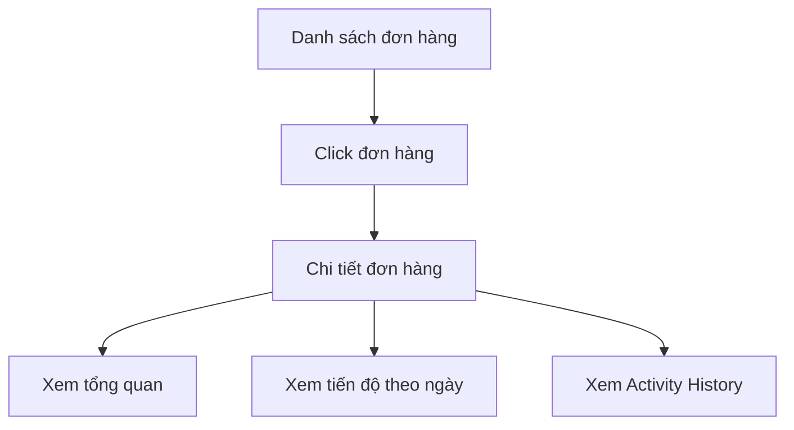
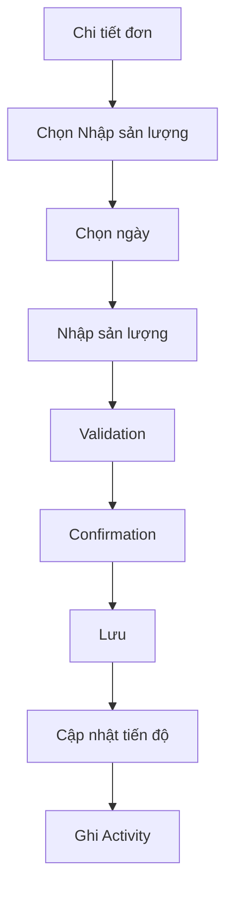
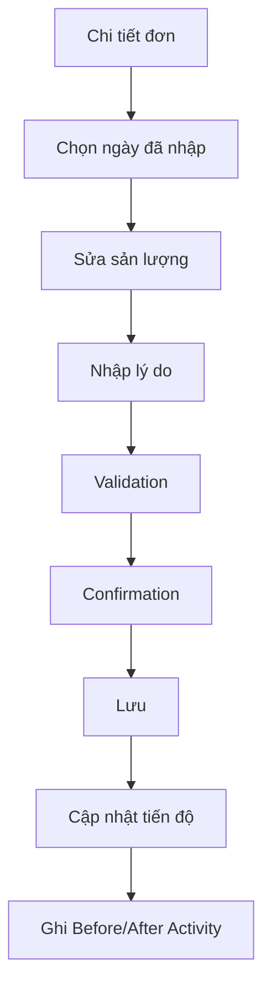
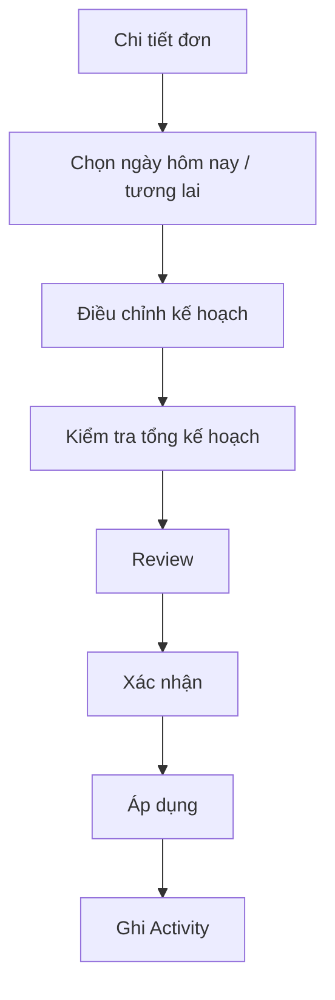

# Màn hình 4 — Chi tiết đơn hàng

## 1. Mục đích

Màn hình Chi tiết đơn hàng giúp quản lý:

- Nắm nhanh tình trạng của một đơn hàng.
- Theo dõi tiến độ sản xuất theo từng ngày.
- Biết đơn đang đúng tiến độ hay chậm.
- Nhập và điều chỉnh dữ liệu sản xuất.
- Xử lý sản lượng thiếu.
- Theo dõi toàn bộ Activity / Audit History của đơn hàng.

Màn hình ưu tiên đơn giản, dễ hiểu và thao tác nhanh cho người dùng không rành công nghệ.

---

## 2. Đối tượng sử dụng

### Giai đoạn 1

- 01 quản lý.
- Sử dụng trên máy tính.
- Có network/internet.

### Tương lai

Thiết kế sẵn để có thể mở rộng cho nhân viên nhập liệu và phân quyền.

---

## 3. UI / Layout

Màn hình gồm 4 khu vực chính:

1. Header / nhận diện đơn hàng.
2. Tổng quan đơn hàng.
3. Bảng tiến độ sản xuất theo ngày.
4. Activity / Audit History.

### 3.1 Header

Hiển thị:

- Nút quay lại Danh sách đơn hàng.
- Mã đơn hàng.
- Trạng thái đơn hàng.
- Deadline.
- Các thao tác chính:
  - Nhập sản lượng.
  - Điều chỉnh kế hoạch.

Nếu đơn đang chậm, hiển thị riêng tình trạng:

> Chậm tiến độ: X đôi

Không dùng "Chậm" làm trạng thái đơn hàng.

### 3.2 Tổng quan

Hiển thị:

- Tổng số lượng.
- Đã hoàn thành.
- Còn lại.
- Deadline.
- Số ngày còn lại.
- Tiến độ (%).
- Tình trạng tiến độ.
- Trạng thái đơn.

Progress được tính theo:

> Sản lượng thực tế / Tổng số lượng đơn.

Tình trạng tiến độ được tính độc lập với Progress.

Ví dụ:

- Progress = 65%.
- Nhưng vẫn có thể đang Chậm tiến độ.

### 3.3 Bảng tiến độ theo ngày

Các cột:

| Cột | Ý nghĩa |
|---|---|
| Ngày | Ngày sản xuất |
| KH ban đầu | Kế hoạch ban đầu của ngày |
| Bù thêm | Sản lượng được bù từ thiếu hụt |
| KH cuối | Kế hoạch sau cùng của ngày |
| Thực tế | Sản lượng thực tế |
| Chênh lệch | Thực tế - KH cuối |
| Tình trạng | Tình trạng sản xuất trong ngày |
| Action | Các thao tác phù hợp với ngày |

Ví dụ:

| Ngày | KH ban đầu | Bù thêm | KH cuối | Thực tế | Chênh lệch | Tình trạng |
|---|---:|---:|---:|---:|---:|---|
| 11/08 | 100 | - | 100 | 80 | -20 | Thiếu |
| 12/08 | 120 | +20 | 140 | 130 | -10 | Thiếu |
| 13/08 | 200 | - | 200 | - | - | Chờ sản xuất |

Ngày chưa có thực tế hiển thị `—`, không hiển thị `0`.

Việc tách KH ban đầu / Bù thêm / KH cuối giúp người dùng thấy rõ lịch sử thay đổi kế hoạch và phân biệt "Bù sản lượng" với "Điều chỉnh kế hoạch".

---

## 4. Business Rules

### 4.1 Trạng thái đơn hàng

Chỉ có:

- Chưa hoàn thành.
- Hoàn thành.

Khi tổng sản lượng thực tế đạt đúng tổng số lượng đơn:

> Đơn tự động chuyển sang Hoàn thành.

Quản lý không được tự đổi trạng thái.

### 4.2 Tình trạng tiến độ

Tách biệt với trạng thái đơn:

- Đúng tiến độ.
- Chậm.

Chậm tiến độ không phải trạng thái đơn hàng.

### 4.3 Progress

Progress:

> Tổng thực tế / Tổng số lượng đơn.

Ví dụ:

> 650 / 1.000 = 65%.

### 4.4 Chênh lệch theo ngày

Công thức:

> Chênh lệch = Thực tế - Kế hoạch cuối.

Ví dụ:

> KH cuối 140, TT 130 → -10.

Ngày chưa có thực tế:

> Chênh lệch = `—`.

### 4.5 Không vượt tổng đơn

Không được để tổng thực tế vượt tổng số lượng đơn.

Nếu đơn còn 50 đôi thì chỉ được nhập tối đa 50 đôi.

### 4.6 Không vượt tổng kế hoạch

Tổng kế hoạch của đơn không được vượt tổng số lượng đơn.

### 4.7 Sửa sản lượng đã nhập

Cho phép quản lý sửa sản lượng đã nhập.

Ví dụ:

> 130 → 125

Khi sửa phải ghi Activity:

- User.
- Thời gian.
- Giá trị trước.
- Giá trị sau.
- Lý do.

### 4.8 Nhập sản lượng cho ngày đã qua

Cho phép nhập sản lượng cho ngày đã qua nếu ngày đó chưa được ghi nhận.

Không khóa dữ liệu chỉ vì ngày đã qua.

### 4.9 Điều chỉnh kế hoạch

Không cho điều chỉnh kế hoạch của ngày đã qua.

Điều chỉnh kế hoạch chỉ áp dụng cho ngày hôm nay và ngày tương lai.

### 4.10 Đơn đã hoàn thành

Khi đơn đạt đủ tổng số lượng:

> Chuyển sang Hoàn thành.

Màn hình chuyển sang trạng thái read-only đối với các thao tác làm thay đổi sản lượng/kế hoạch.

Vẫn cho phép xem toàn bộ dữ liệu và Activity History.

### 4.11 Phân biệt điều chỉnh kế hoạch và bù sản lượng

#### Điều chỉnh kế hoạch bình thường

Quản lý chủ động thay đổi kế hoạch.

Activity:

> Điều chỉnh kế hoạch.

#### Bù sản lượng

Xuất phát từ sản lượng thiếu.

Activity phải ghi rõ:

> Bù sản lượng thiếu X đôi.

Không ghi chung thành "Điều chỉnh kế hoạch".

---

## 5. Các thao tác

### 5.1 Nhập sản lượng

Có thể thực hiện từ:

- Nút "Nhập sản lượng" ở Header.
- Action phù hợp tại từng ngày.

### 5.2 Điều chỉnh kế hoạch

Có thể thực hiện từ:

- Nút "Điều chỉnh kế hoạch".
- Action phù hợp tại ngày hôm nay / ngày tương lai.

### 5.3 Xử lý sản lượng thiếu

Có thể truy cập từ tình trạng thiếu hoặc action phù hợp.

Có 2 phương án đã được chốt ở nghiệp vụ:

- Option 1: Chọn ngày để bù.
- Option 2: Hệ thống đề xuất chia đều.

Việc thiết kế UI chi tiết của hai option là các màn hình tiếp theo.

---

## 6. User Flow

### 6.1 Xem chi tiết đơn

### 6.2 Nhập sản lượng

### 6.3 Sửa sản lượng

### 6.4 Điều chỉnh kế hoạch

---

## 7. Các trạng thái UI

### Loading

Hiển thị loading cho:

- Tổng quan.
- Bảng tiến độ.
- Activity History.

### Loaded

Hiển thị đầy đủ dữ liệu.

### Error

Hiển thị thông báo lỗi và cho phép thử lại.

### Empty Activity

Nếu chưa có Activity:

> Chưa có hoạt động nào.

### Đơn đang đúng tiến độ

Hiển thị tình trạng:

> Đúng tiến độ.

### Đơn đang chậm

Hiển thị cảnh báo:

> Chậm tiến độ: X đôi.

Có thể dẫn tới thao tác xử lý thiếu.

### Đơn hoàn thành

Hiển thị:

> Hoàn thành.

Các thao tác thay đổi dữ liệu bị khóa/read-only.

### Ngày chưa có sản lượng

Thực tế và chênh lệch hiển thị:

> `—`

### Ngày có thiếu sản lượng

Hiển thị rõ số lượng thiếu.

---

## 8. Validation

### Nhập sản lượng

Không cho:

- Nhập số âm.
- Nhập vượt số lượng còn lại.
- Làm tổng thực tế vượt tổng đơn.

Thông báo đề xuất:

> Số lượng hoàn thành không thể vượt quá số lượng của đơn hàng. Đơn hàng còn lại: X đôi.

### Sửa sản lượng

Phải:

- Là số hợp lệ.
- Không làm tổng thực tế vượt tổng đơn.
- Có lý do khi thay đổi.

### Điều chỉnh kế hoạch

Phải:

- Không điều chỉnh ngày đã qua.
- Tổng kế hoạch sau điều chỉnh không vượt tổng đơn.
- Review trước khi áp dụng.

### Bù sản lượng

Phải:

- Không làm tổng kế hoạch vượt tổng đơn.
- Có review trước khi áp dụng.
- Ghi nhận Activity riêng là Bù sản lượng.

---

## 9. Audit / User liên quan

Mọi thay đổi quan trọng phải ghi:

- User thực hiện.
- Thời gian.
- Loại thao tác.
- Nội dung.
- Giá trị trước.
- Giá trị sau nếu có.
- Lý do nếu có.

Các event tối thiểu:

- Tạo đơn.
- Điều chỉnh kế hoạch.
- Bù sản lượng.
- Nhập sản lượng.
- Sửa sản lượng.

Activity History:

- Không được xóa.
- Không hiển thị toàn bộ trên Dashboard.
- Được hiển thị tại Chi tiết đơn hàng.

---

## 10. Tiêu chí hoàn thành

Màn hình được xem là hoàn thành khi:

- Quản lý nhìn vào có thể biết ngay đơn đang ở trạng thái nào.
- Biết tổng số lượng, đã làm, còn lại.
- Biết deadline và số ngày còn lại.
- Biết Progress.
- Biết đơn đúng tiến độ hay chậm.
- Theo dõi được kế hoạch từng ngày.
- Phân biệt được KH ban đầu, Bù thêm và KH cuối.
- Theo dõi được thực tế từng ngày.
- Thấy được chênh lệch.
- Có thể nhập sản lượng.
- Có thể sửa sản lượng theo rule.
- Có thể điều chỉnh kế hoạch theo rule.
- Có thể truy cập xử lý sản lượng thiếu.
- Xem được Activity History.
- Mọi thay đổi quan trọng đều có user và audit.
- Không có thao tác nào làm tổng thực tế vượt tổng đơn.
- Không có thao tác nào làm tổng kế hoạch vượt tổng đơn.
- Đơn đạt đủ sản lượng tự động chuyển Hoàn thành.
- Đơn Hoàn thành chuyển sang read-only.

---

## 11. Phạm vi

### In scope

- Chi tiết một đơn hàng.
- Tổng quan tiến độ.
- Tiến độ theo ngày.
- Nhập sản lượng.
- Sửa sản lượng.
- Điều chỉnh kế hoạch.
- Truy cập xử lý thiếu.
- Activity / Audit History.
- Các validation liên quan.

### Out of scope

- Quản lý mẫu giày.
- Loại giày.
- Size.
- Màu.
- Quản lý nguyên vật liệu.
- Quản lý công đoạn sản xuất.
- Quản lý nhân sự.
- Phân quyền chi tiết.
- Nhiều đơn/ngày ở giai đoạn hiện tại.
- Các chức năng ERP khác.

---

## 12. Quyết định nghiệp vụ đã chốt

1. Cho phép sửa sản lượng đã nhập.
2. Sửa sản lượng phải ghi Before/After và lý do.
3. Cho phép nhập sản lượng cho ngày đã qua nếu chưa ghi nhận.
4. Không cho điều chỉnh kế hoạch của ngày đã qua.
5. Khi đơn hoàn thành, màn hình chuyển sang read-only đối với thao tác thay đổi.
6. Chênh lệch ngày = Thực tế - Kế hoạch cuối.
7. Progress = Tổng thực tế / Tổng số lượng đơn.
8. Chậm tiến độ được tách khỏi trạng thái đơn hàng.
9. Phân biệt rõ Điều chỉnh kế hoạch và Bù sản lượng.
10. Activity History không được xóa.
