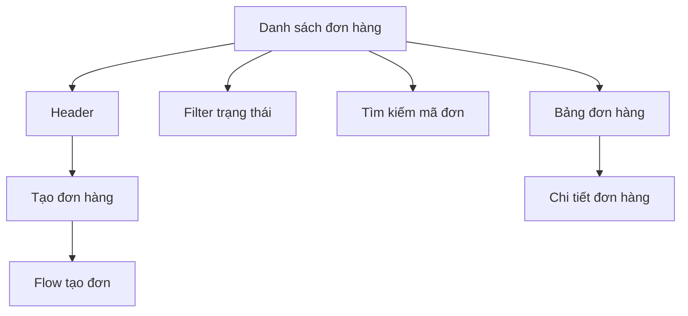
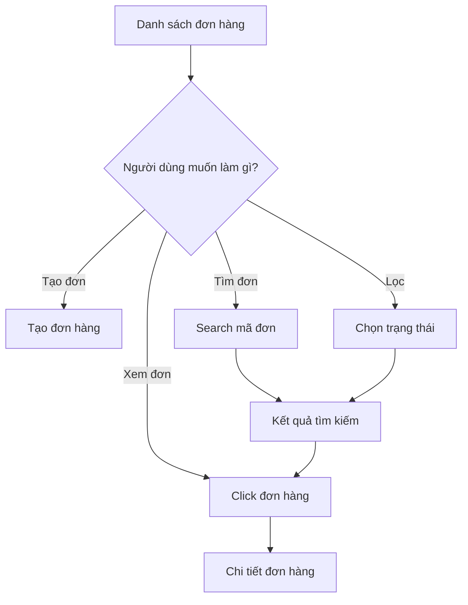

# Production Management Web App
# Screen Specification: Order List

## 1. Mục đích

Màn hình Danh sách đơn hàng giúp quản lý xem toàn bộ các đơn hàng đang được theo dõi và nhanh chóng xác định tình trạng của từng đơn.

Mục tiêu:

- Xem toàn bộ đơn hàng.
- Phân biệt đơn chưa hoàn thành và đã hoàn thành.
- Nhận biết đơn đang chậm tiến độ.
- Xem tổng số lượng, đã hoàn thành, còn lại và deadline.
- Tìm nhanh theo mã đơn hàng.
- Lọc theo trạng thái.
- Mở nhanh Chi tiết đơn hàng.
- Tạo đơn hàng mới.

Dashboard dùng để "nhìn nhanh và phát hiện vấn đề"; Danh sách đơn hàng dùng để "tìm và quản lý một đơn cụ thể".

---

## 2. Đối tượng sử dụng

### Giai đoạn 1

- 1 quản lý.

### Tương lai

- Quản lý.
- Nhân viên nhập liệu.
- Có thể mở rộng thêm phân quyền.

---

## 3. Layout tổng thể

```text
┌─────────────────────────────────────────────────────────────┐
│ Đơn hàng                                      [+ Tạo đơn]   │
│ Quản lý các đơn hàng sản xuất                              │
│                                                             │
│ [ Tất cả ] [ Chưa hoàn thành ] [ Hoàn thành ]              │
│                                                             │
│ 🔍 Tìm mã đơn hàng...                                      │
│                                                             │
├─────────────────────────────────────────────────────────────┤
│                                                             │
│ Mã đơn   Tổng SL   Đã làm   Còn lại   Deadline  Tiến độ    │
│                                                             │
│ ORD-001   1,000      760      240     15/08      76%       │
│ ORD-002     800      800        0     14/08     100%       │
│ ORD-003     500      300      200     18/08      60%       │
│                                                             │
└─────────────────────────────────────────────────────────────┘
```

---

## 4. Header

Header gồm:

- Tiêu đề: `Đơn hàng`
- Mô tả: `Quản lý các đơn hàng sản xuất`
- CTA chính: `+ Tạo đơn hàng`

Click CTA → mở Flow Tạo đơn hàng.

---

## 5. Bộ lọc trạng thái

Chỉ có 3 lựa chọn:

```text
[ Tất cả ] [ Chưa hoàn thành ] [ Hoàn thành ]
```

### Tất cả

Hiển thị toàn bộ đơn hàng.

### Chưa hoàn thành

Hiển thị các đơn đang trong quá trình sản xuất.

### Hoàn thành

Hiển thị các đơn đã đạt đủ sản lượng.

### Quy tắc quan trọng

"Chậm" không phải là trạng thái đơn hàng.

Hai khái niệm phải tách biệt:

```text
Trạng thái đơn:
- Chưa hoàn thành
- Hoàn thành

Tình trạng tiến độ:
- Đúng tiến độ
- Chậm
```

Ví dụ:

```text
Trạng thái: Chưa hoàn thành
Tình trạng tiến độ: 🔴 Chậm
```

---

## 6. Search

Cho phép tìm theo:

- Mã đơn hàng.

Ví dụ:

```text
🔍 [ ORD-001                         ]
```

Không cần tìm theo:

- Mẫu giày.
- Size.
- Màu.
- Loại sản phẩm.

Các thông tin này không thuộc phạm vi nghiệp vụ giai đoạn 1.

---

## 7. Bảng đơn hàng

Các cột:

| Cột | Ý nghĩa |
|---|---|
| Mã đơn | Mã định danh đơn hàng |
| Tổng SL | Tổng số đôi cần hoàn thành |
| Đã hoàn thành | Tổng sản lượng thực tế lũy kế |
| Còn lại | Tổng SL - đã hoàn thành |
| Deadline | Ngày cần hoàn thành |
| Tiến độ | Tỷ lệ hoàn thành |
| Tình trạng | Đúng tiến độ / Chậm / Hoàn thành |

Ví dụ:

```text
┌────────┬────────┬────────┬────────┬──────────┬─────────┬──────────┐
│ Mã đơn │ Tổng   │ Đã làm │ Còn lại│ Deadline │ Tiến độ │ Tình trạng│
├────────┼────────┼────────┼────────┼──────────┼─────────┼──────────┤
│ORD-001 │ 1,000  │ 760    │ 240    │ 15/08    │ 76%     │ 🔴 Chậm  │
│ORD-002 │ 800    │ 800    │ 0      │ 14/08    │ 100%    │ ✓ Xong   │
│ORD-003 │ 500    │ 300    │ 200    │ 18/08    │ 60%     │ 🟢 Đúng  │
└────────┴────────┴────────┴────────┴──────────┴─────────┴──────────┘
```

---

## 8. Tiến độ

Tiến độ nên được thể hiện bằng cả:

- Phần trăm.
- Progress bar.

Ví dụ:

```text
76%

███████████████░░░░░
```

Mục tiêu là giúp người dùng nhận biết nhanh mà không phải đọc nhiều số.

---

## 9. Tình trạng tiến độ

### Đúng tiến độ

Sản lượng thực tế lũy kế đang đạt yêu cầu theo kế hoạch tại thời điểm hiện tại.

Ví dụ:

- Kế hoạch lũy kế: 280
- Thực tế lũy kế: 300

→ `🟢 Đúng tiến độ`

Có thể hiểu là đang vượt kế hoạch 20 đôi, nhưng không cần tạo thêm trạng thái "Vượt tiến độ" trong giai đoạn 1.

### Chậm

Ví dụ:

- Kế hoạch lũy kế: 420
- Thực tế lũy kế: 380

→ `🔴 Chậm 40 đôi`

Số lượng thiếu nên được hiển thị trực tiếp.

### Hoàn thành

Khi tổng sản lượng thực tế đạt đúng tổng số lượng đơn hàng:

→ `✓ Hoàn thành`

---

## 10. Click đơn hàng

Toàn bộ row có thể click.

Ví dụ:

```text
Click ORD-001
        ↓
Chi tiết đơn hàng ORD-001
```

Không cần thêm cột hoặc nút `View`.

Mục tiêu là giảm số thao tác.

---

## 11. Tạo đơn hàng

CTA:

```text
+ Tạo đơn hàng
```

Flow:

```text
Tạo đơn
   ↓
Nhập thông tin đơn
   ↓
Lập kế hoạch
   ↓
Kiểm tra tổng kế hoạch
   ↓
Xác nhận
   ↓
Tạo đơn thành công
   ↓
Chi tiết đơn hàng
```

Chi tiết nghiệp vụ của Flow Tạo đơn hàng và Lập kế hoạch được thiết kế ở màn hình riêng.

---

## 12. Empty State

### Chưa có đơn hàng

```text
┌─────────────────────────────────────────┐
│                                         │
│                 📦                      │
│                                         │
│          Chưa có đơn hàng               │
│                                         │
│  Tạo đơn hàng đầu tiên để bắt đầu      │
│  theo dõi sản xuất.                    │
│                                         │
│          [ + Tạo đơn hàng ]            │
│                                         │
└─────────────────────────────────────────┘
```

### Không có kết quả sau khi filter/search

Ví dụ:

> Không tìm thấy đơn hàng phù hợp.

Không dùng cùng một empty state cho mọi trường hợp.

---

## 13. Pagination

Giai đoạn 1 chưa cần pagination phức tạp nếu số lượng đơn còn nhỏ.

Khi số lượng đơn tăng:

- Có thể thêm pagination.
- Giữ filter và search khi chuyển trang.

Đây là khả năng mở rộng, chưa phải yêu cầu bắt buộc giai đoạn 1.

---

## 14. Desktop / Responsive

Giai đoạn 1:

- Desktop-first.
- Tối ưu cho máy tính.

Không cần ưu tiên mobile ngay.

Tuy nhiên layout không nên thiết kế quá cứng để có thể responsive trong tương lai.

---

## 15. User & Audit

Không hiển thị người tạo/người chỉnh sửa ngay trong bảng danh sách.

Lý do:

- Làm bảng nặng.
- Không phục vụ nhu cầu xem nhanh.

Thông tin user nằm trong:

`Chi tiết đơn hàng → Lịch sử hoạt động`

Ví dụ:

```text
👤 Nguyễn Văn A
Tạo đơn ORD-001
11/08/2026 08:30
```

hoặc:

```text
👤 Trần Văn B
Nhập sản lượng: 80 đôi
11/08/2026 18:15
```

Mọi thao tác thay đổi dữ liệu quan trọng phải gắn với tài khoản thực hiện.

---

## 16. Business Rules liên quan

### Tổng số lượng

Là tổng số đôi cần hoàn thành của đơn hàng.

### Đã hoàn thành

Tổng sản lượng thực tế lũy kế.

### Còn lại

Tổng số lượng đơn hàng trừ sản lượng thực tế lũy kế.

Không được âm.

### Tiến độ

Tỷ lệ sản lượng thực tế đã hoàn thành so với tổng số lượng đơn.

### Trạng thái đơn

Chỉ có:

- Chưa hoàn thành.
- Hoàn thành.

### Tình trạng tiến độ

Có thể là:

- Đúng tiến độ.
- Chậm.
- Hoàn thành.

### Không tự động thay đổi kế hoạch

Danh sách chỉ hiển thị dữ liệu và trạng thái.

Không tự động điều chỉnh kế hoạch sản xuất.

---

## 17. Mermaid — cấu trúc màn hình



---

## 18. Mermaid — workflow



---

## 19. Tiêu chí hoàn thành

Màn hình đạt yêu cầu khi quản lý có thể:

1. Xem toàn bộ đơn hàng.
2. Phân biệt ngay đơn hoàn thành và chưa hoàn thành.
3. Biết đơn nào đang chậm.
4. Biết mỗi đơn đã hoàn thành bao nhiêu.
5. Biết còn bao nhiêu.
6. Biết deadline.
7. Tìm nhanh theo mã đơn.
8. Lọc theo trạng thái.
9. Mở chi tiết đơn bằng một thao tác.
10. Tạo đơn mới.

---

## 20. Ngoài phạm vi

Không đưa vào màn hình này trong giai đoạn 1:

- Báo cáo nâng cao.
- Phân tích theo tháng/quý.
- Export Excel.
- Quản lý nguyên vật liệu.
- Quản lý mẫu/size/màu.
- Quản lý kho.
- Quản lý máy móc.
- Phân tích hiệu suất nhân viên.
- ERP.

Các chức năng này chỉ được bổ sung khi có nhu cầu thực tế.

---

## 21. Trạng thái màn hình cần thiết kế

UI cần tính đến tối thiểu:

1. Có dữ liệu.
2. Không có dữ liệu.
3. Search không có kết quả.
4. Filter không có kết quả.
5. Đang tải dữ liệu.
6. Lỗi tải dữ liệu.
7. Có đơn đang chậm.
8. Có đơn đã hoàn thành.
9. Danh sách nhiều đơn hàng.

---

## 22. Nguyên tắc UX

- Đơn giản.
- Ít thao tác.
- Thông tin quan trọng dễ nhìn.
- Không biến "chậm" thành một trạng thái đơn hàng.
- Không bắt người dùng tự tính chênh lệch.
- Không đưa quá nhiều thông tin audit vào bảng.
- Click row để xem chi tiết.
- Tạo đơn là CTA chính.
- Desktop-first.
- Có khả năng mở rộng khi số lượng đơn tăng.
