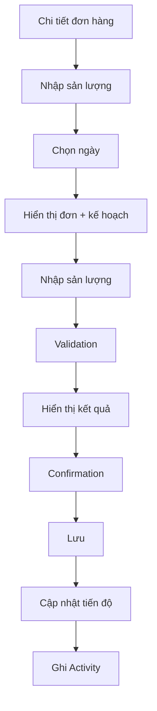
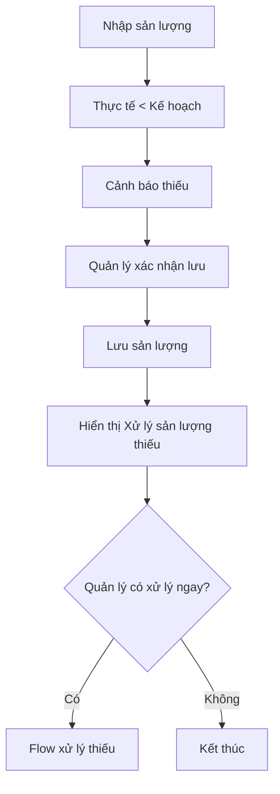
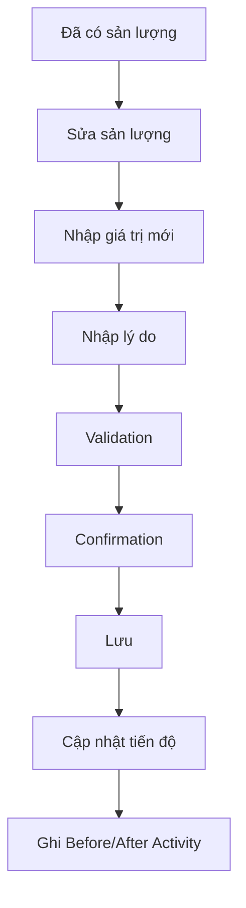

# Màn hình 5 — Nhập sản lượng cuối ngày

## 1. Mục đích

Màn hình giúp quản lý ghi nhận sản lượng thực tế theo ngày với ít thao tác nhất.

Mục tiêu:

- Chọn ngày sản xuất.
- Xem đơn hàng và kế hoạch của ngày.
- Nhập sản lượng thực tế.
- Nhận biết ngay sản xuất đúng kế hoạch hay thiếu.
- Không cho nhập vượt số lượng còn lại của đơn.
- Xác nhận trước khi lưu.
- Ghi Activity cho mọi thay đổi quan trọng.
- Sau khi ghi nhận thiếu, cho phép quản lý chuyển sang xử lý sản lượng thiếu nhưng không bắt buộc.

---

## 2. Đối tượng sử dụng

### Giai đoạn 1

- 01 quản lý.
- Sử dụng trên máy tính.
- Có network/internet.

### Tương lai

Có thể mở rộng cho nhân viên nhập liệu và phân quyền.

---

## 3. UI / Layout

Màn hình gồm:

1. Header.
2. Chọn ngày sản xuất.
3. Thông tin đơn hàng.
4. Thông tin kế hoạch.
5. Ô nhập sản lượng thực tế.
6. Kết quả sau khi nhập.
7. Confirmation.
8. Kết quả sau khi lưu.

### 3.1 Header

Hiển thị:

- Nút quay lại Chi tiết đơn hàng.
- Tiêu đề "Nhập sản lượng".

### 3.2 Ngày sản xuất

Người dùng chọn ngày cần ghi nhận.

Giai đoạn 1 mỗi ngày chỉ có một đơn hàng, nên không cần bắt người dùng chọn đơn nếu hệ thống đã xác định được đơn của ngày đó.

Thiết kế phải sẵn sàng mở rộng cho trường hợp tương lai có nhiều đơn/ngày.

### 3.3 Thông tin đơn hàng

Hiển thị:

- Mã đơn hàng.

### 3.4 Thông tin kế hoạch

Hiển thị:

- Kế hoạch hôm nay.
- Đã hoàn thành trước đó.
- Còn lại trước khi nhập.

Ví dụ:

```text
Kế hoạch hôm nay:       100 đôi
Đã hoàn thành trước đó: 650 đôi
Còn lại trước khi nhập: 350 đôi
```

### 3.5 Ô nhập sản lượng

Người dùng chỉ nhập:

> Sản lượng thực tế hôm nay.

Không yêu cầu người dùng tự nhập số lượng thiếu.

Hệ thống tự tính số lượng thiếu/chênh lệch.

Nếu ngày đã có sản lượng:

- Hiển thị sản lượng đã nhập.
- Cho phép sửa theo business rules.

---

## 4. Business Rules

### 4.1 Kế hoạch bằng 0

Nếu:

> Kế hoạch cuối = 0

thì:

- Không cho nhập sản lượng thực tế.
- Không cho nhập `0` như một bản ghi sản lượng.
- Nút/ô nhập sản lượng ở trạng thái disabled.
- Hiển thị rõ lý do:

> Ngày này không có kế hoạch sản xuất. Không thể nhập sản lượng thực tế.

Nếu muốn sản xuất vào ngày này:

> Phải điều chỉnh kế hoạch trước, sau đó mới được nhập sản lượng.

### 4.2 Nhập sản lượng thấp hơn kế hoạch

Cho phép nhập.

Ví dụ:

```text
Kế hoạch: 100
Thực tế: 80
Thiếu: 20
```

Hệ thống cảnh báo:

> Thiếu 20 đôi.

Không bắt buộc nhập lý do tại bước ghi nhận sản lượng.

Việc xử lý sản lượng thiếu là một flow riêng.

### 4.3 Nhập đúng kế hoạch

Ví dụ:

```text
Kế hoạch: 100
Thực tế: 100
Chênh lệch: 0
```

Hiển thị:

> Đạt kế hoạch hôm nay.

### 4.4 Không được nhập vượt tổng đơn

Ví dụ:

```text
Tổng đơn: 1.000
Đã hoàn thành: 950
Người dùng nhập: 60
```

Không cho lưu.

Chỉ được nhập tối đa:

> 50 đôi.

Thông báo:

> Số lượng hoàn thành không thể vượt quá số lượng của đơn hàng. Đơn hàng còn lại: 50 đôi.

### 4.5 Cho phép nhập ngày đã qua

Nếu ngày đã qua nhưng chưa có sản lượng:

- Cho phép nhập bình thường.

Nếu ngày đã qua đã có sản lượng:

- Cho phép sửa sản lượng theo rule sửa sản lượng.

### 4.6 Sửa sản lượng đã nhập

Cho phép sửa.

Ví dụ:

> 80 → 75

Khi sửa:

- Bắt buộc nhập lý do.
- Ghi Activity.
- Lưu Before/After.

Activity:

```text
Sửa sản lượng
11/08: 80 → 75 đôi

Lý do: Nhập nhầm số lượng thực tế.
```

### 4.7 Đơn đã hoàn thành

Khi tổng thực tế đạt tổng số lượng đơn:

> Đơn tự động chuyển Hoàn thành.

Không cho nhập thêm sản lượng.

Màn hình ở trạng thái read-only đối với các thao tác thay đổi dữ liệu.

---

## 5. Tính toán sau khi nhập

### Đúng kế hoạch

```text
Kế hoạch: 100
Thực tế: 100
Chênh lệch: 0

✓ Đạt kế hoạch hôm nay
```

### Thiếu

```text
Kế hoạch: 100
Thực tế: 80
Chênh lệch: -20

⚠ Thiếu 20 đôi
```

### Vượt kế hoạch

Nếu thực tế lớn hơn kế hoạch nhưng vẫn không vượt số lượng còn lại của đơn:

- Cho phép theo rule tổng đơn.
- Không coi đây là lỗi chỉ vì vượt kế hoạch.
- Chênh lệch được tính theo:

> Thực tế - Kế hoạch cuối.

---

## 6. Confirmation

Không confirmation ngay khi người dùng nhập số.

Người dùng nhập xong → xem kết quả → bấm "Xác nhận lưu".

Modal xác nhận hiển thị:

- Ngày.
- Đơn hàng.
- Sản lượng thực tế.
- Kế hoạch hôm nay.
- Số lượng thiếu/chênh lệch nếu có.

Ví dụ:

```text
Xác nhận sản lượng

Ngày: 11/08/2026
Đơn hàng: DH-20260811
Sản lượng thực tế: 80 đôi

Kế hoạch hôm nay: 100 đôi
Thiếu: 20 đôi

[Quay lại] [Xác nhận]
```

---

## 7. Sau khi lưu

Hiển thị xác nhận thành công:

```text
✓ Đã ghi nhận 80 đôi

Kế hoạch hôm nay: 100
Thực tế: 80
Thiếu: 20
```

Nếu có thiếu:

Hiển thị:

```text
[Xử lý sản lượng thiếu] [Xem chi tiết đơn]
```

Nút "Xử lý sản lượng thiếu" chỉ là đề xuất hành động.

Không bắt buộc người dùng phải xử lý ngay.

---

## 8. Xử lý sản lượng thiếu

Khi sản lượng thực tế thấp hơn kế hoạch:

- Chỉ cảnh báo.
- Không tự thay đổi kế hoạch.
- Không tự chuyển sang flow bù.
- Không bắt buộc nhập lý do.
- Không bắt buộc xử lý ngay.

Quản lý tự quyết định có xử lý thiếu hay không.

Hai phương án xử lý thiếu sẽ được thiết kế ở các màn hình tiếp theo:

- Option 1 — Chọn ngày để bù.
- Option 2 — Hệ thống đề xuất chia đều.

---

## 9. User Flow

### 9.1 Nhập sản lượng mới



### 9.2 Nhập thiếu



### 9.3 Sửa sản lượng



---

## 10. Các trạng thái UI

### Loading

Hiển thị loading khi tải:

- Ngày.
- Đơn hàng.
- Kế hoạch.
- Sản lượng hiện tại.

### Loaded

Hiển thị form nhập bình thường.

### Kế hoạch = 0

- Ô/nút nhập sản lượng disabled.
- Hiển thị lý do không thể nhập.

### Chưa nhập sản lượng

Hiển thị ô nhập trống.

### Đã nhập sản lượng

Hiển thị sản lượng hiện tại và cho phép sửa theo rule.

### Đạt kế hoạch

Hiển thị:

> Đạt kế hoạch hôm nay.

### Thiếu

Hiển thị cảnh báo:

> Thiếu X đôi.

### Nhập vượt số lượng còn lại

- Không cho xác nhận.
- Hiển thị số lượng tối đa có thể nhập.

### Đơn hoàn thành

- Hiển thị Hoàn thành.
- Không cho nhập thêm.
- Form read-only.

### Error

Hiển thị lỗi và cho phép thử lại.

---

## 11. Validation

### Sản lượng

Không cho:

- Số âm.
- Giá trị không hợp lệ.
- Tổng thực tế vượt tổng đơn.

### Kế hoạch = 0

Không cho nhập sản lượng.

### Sửa sản lượng

Phải:

- Nhập giá trị hợp lệ.
- Không làm tổng thực tế vượt tổng đơn.
- Có lý do.

### Confirmation

Chỉ cho xác nhận khi dữ liệu hợp lệ.

---

## 12. Audit / User liên quan

Mọi thao tác thay đổi sản lượng phải ghi:

- User thực hiện.
- Thời gian.
- Loại thao tác.
- Nội dung.
- Giá trị trước.
- Giá trị sau nếu có.
- Lý do nếu có.

Event tối thiểu:

- Nhập sản lượng.
- Sửa sản lượng.

Activity không được xóa.

---

## 13. Tiêu chí hoàn thành

Màn hình được xem là hoàn thành khi:

- Có thể chọn ngày cần ghi nhận.
- Hiển thị đúng đơn hàng của ngày.
- Hiển thị kế hoạch hôm nay.
- Hiển thị sản lượng đã hoàn thành trước đó.
- Hiển thị số lượng còn lại.
- Nhập sản lượng nhanh.
- Không cho nhập khi kế hoạch = 0.
- Không cho vượt tổng đơn.
- Cảnh báo rõ khi thiếu.
- Cho phép đạt đúng kế hoạch.
- Cho phép thực tế vượt kế hoạch nếu tổng thực tế vẫn không vượt tổng đơn.
- Có confirmation trước khi lưu.
- Ghi Activity sau khi lưu.
- Cho phép sửa sản lượng đã nhập.
- Sửa phải có lý do và Before/After.
- Cho phép nhập cho ngày đã qua nếu chưa ghi nhận.
- Đơn hoàn thành tự động chuyển read-only.
- Sau khi lưu thiếu, đề xuất xử lý thiếu nhưng không bắt buộc.

---

## 14. Phạm vi

### In scope

- Chọn ngày.
- Xác định đơn hàng.
- Xem kế hoạch.
- Nhập sản lượng.
- Sửa sản lượng.
- Validation.
- Confirmation.
- Cảnh báo thiếu.
- Ghi Activity.
- Chuyển sang xử lý thiếu.

### Out of scope

- Thiết kế chi tiết Option 1 xử lý thiếu.
- Thiết kế chi tiết Option 2 xử lý thiếu.
- Điều chỉnh kế hoạch.
- Quản lý sản phẩm/mẫu/size/màu.
- Quản lý nhân viên và phân quyền.
- Các chức năng ERP khác.

---

## 15. Quyết định nghiệp vụ đã chốt

1. Kế hoạch = 0 → không cho nhập thực tế.
2. Không cho nhập `0` như một bản ghi sản lượng khi kế hoạch = 0.
3. Muốn sản xuất vào ngày kế hoạch = 0 → phải điều chỉnh kế hoạch trước.
4. Sản lượng thấp hơn kế hoạch vẫn cho phép nhập.
5. Không bắt buộc nhập lý do khi sản lượng thấp hơn kế hoạch.
6. Sau khi lưu thiếu, chỉ đề xuất xử lý thiếu, không bắt buộc xử lý ngay.
7. Sản lượng vượt kế hoạch nhưng không vượt tổng đơn → cho phép.
8. Tổng thực tế không được vượt tổng đơn.
9. Cho phép nhập cho ngày đã qua nếu chưa có sản lượng.
10. Cho phép sửa sản lượng đã nhập.
11. Sửa sản lượng bắt buộc có lý do và Before/After Activity.
12. Đơn đạt đủ tổng số lượng tự động Hoàn thành.
13. Đơn Hoàn thành không được nhập thêm sản lượng.
