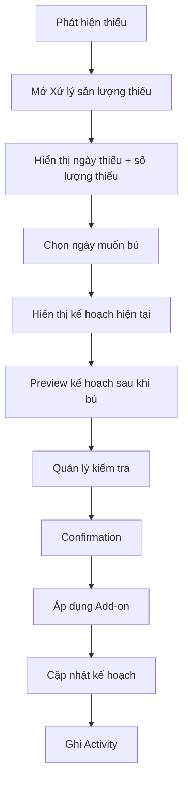
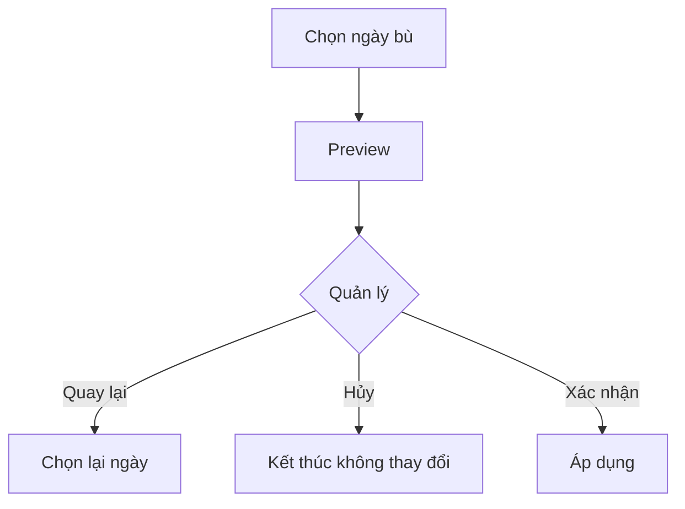

# Màn hình 6 — Xử lý sản lượng thiếu — Option 1: Chọn ngày để bù

## 1. Mục đích

Màn hình cho phép quản lý xử lý phần sản lượng bị thiếu bằng cách chọn một ngày sản xuất khác để bù toàn bộ số lượng thiếu.

Mục tiêu:

- Hiển thị rõ ngày phát sinh thiếu.
- Hiển thị chính xác số lượng cần bù.
- Cho phép quản lý chọn ngày muốn bù.
- Hiển thị kế hoạch hiện tại của ngày được chọn.
- Preview kế hoạch sau khi bù trước khi áp dụng.
- Chỉ áp dụng thay đổi sau khi quản lý xác nhận.
- Ghi Activity cho thao tác bù sản lượng.
- Không tự động thay đổi kế hoạch của các ngày khác.

---

## 2. Đối tượng sử dụng

### Giai đoạn 1

- 01 quản lý.
- Sử dụng trên máy tính.
- Có network/internet.

### Tương lai

Có thể mở rộng cho nhân viên và phân quyền.

---

## 3. UI / Layout

Màn hình gồm các khu vực:

1. Thông tin sản lượng thiếu.
2. Chọn ngày muốn bù.
3. Preview kế hoạch trước/sau khi bù.
4. Confirmation.
5. Kết quả sau khi áp dụng.

### 3.1 Thông tin sản lượng thiếu

Hiển thị rõ:

- Ngày phát sinh thiếu.
- Kế hoạch của ngày đó.
- Thực tế của ngày đó.
- Số lượng thiếu.

Ví dụ:

```text
Ngày thiếu:       11/08/2026
Kế hoạch:         100 đôi
Thực tế:           80 đôi
Số lượng cần bù:   20 đôi
```

### 3.2 Chọn ngày muốn bù

Hiển thị các ngày có thể nhận phần bù.

Mỗi ngày hiển thị:

- Ngày.
- Kế hoạch hiện tại.

Ví dụ:

```text
○ 12/08/2026
  Kế hoạch hiện tại: 120 đôi

○ 13/08/2026
  Kế hoạch hiện tại: 200 đôi

○ 14/08/2026
  Kế hoạch hiện tại: 250 đôi
```

Khi chọn ngày:

```text
● 12/08/2026
  Kế hoạch hiện tại: 120 đôi
```

### 3.3 Không nhập số lượng bù

Người dùng không nhập số lượng bù.

Nếu hệ thống xác định thiếu 20 đôi:

> Option 1 luôn bù đủ 20 đôi.

Không cho người dùng chọn 15, 20 hoặc 30 đôi.

Lý do:

Option 1 là nghiệp vụ chuyển toàn bộ phần thiếu sang ngày khác, không phải nhập một phần thiếu tùy ý.

---

## 4. Business Rules

### 4.1 Bù toàn bộ số lượng thiếu

Nếu:

```text
Kế hoạch: 100
Thực tế: 80
Thiếu: 20
```

thì Option 1 phải bù:

> +20 đôi.

Không cho bù một phần.

### 4.2 Chọn ngày để bù

Quản lý chủ động chọn ngày muốn nhận phần thiếu.

Khi chọn ngày:

> Chỉ ngày được chọn mới nhận Add-on.

Không giảm kế hoạch của bất kỳ ngày nào khác.

### 4.3 Add-on

Ví dụ:

```text
11/08
KH: 100
TT: 80
Thiếu: 20

12/08
KH ban đầu: 120
Add-on: +20
KH cuối: 140
```

Các ngày khác không thay đổi.

### 4.4 Tổng đơn không thay đổi

Bù sản lượng không làm tăng số lượng của đơn hàng.

Ví dụ:

```text
Tổng đơn: 1.000 đôi
```

vẫn là:

> 1.000 đôi.

Add-on chỉ thể hiện phần kế hoạch được chuyển sang ngày khác.

### 4.5 Tổng kế hoạch sau bù

Kế hoạch ban đầu có tổng bằng tổng đơn.

Sau khi bù:

> Tổng kế hoạch cuối có thể lớn hơn tổng số lượng đơn.

Ví dụ:

```text
Tổng đơn:       1.000
KH ban đầu:     1.000
Add-on:            20
KH cuối:         1.020
```

`1.020` không có nghĩa đơn hàng tăng thành 1.020.

Nó chỉ phản ánh tổng kế hoạch sau các lần Add-on.

### 4.6 Tổng thực tế

Tổng thực tế tuyệt đối không được vượt tổng số lượng đơn.

Ví dụ:

```text
Tổng đơn:       1.000
Tổng thực tế:   1.000
```

→ Đơn hoàn thành.

Không được nhập thêm.

Đây là giới hạn cứng của sản lượng thực tế.

### 4.7 Phân biệt Bù sản lượng và Điều chỉnh kế hoạch

Bù sản lượng:

- Xuất phát từ thiếu sản lượng.
- Có nguồn từ một ngày thiếu.
- Có Add-on.
- Không giảm kế hoạch ngày khác.
- Activity ghi rõ "Bù sản lượng thiếu".

Điều chỉnh kế hoạch:

- Là thay đổi kế hoạch chủ động.
- Là nghiệp vụ riêng.
- Không được ghi chung thành Bù sản lượng.

---

## 5. Preview kế hoạch

Không áp dụng ngay khi chọn ngày.

Sau khi chọn ngày, hiển thị preview:

```text
Kế hoạch trước và sau khi bù

Ngày       Hiện tại    Sau khi bù
11/08        100          100
12/08        120          140
13/08        200          200
14/08        250          250
15/08        330          330
```

Chỉ dòng ngày được chọn thay đổi:

```text
12/08
120 → 140
     +20
```

Thông báo:

> Bù 20 đôi từ ngày 11/08 sang ngày 12/08.

Không thay đổi kế hoạch của các ngày còn lại.

---

## 6. Confirmation

Không áp dụng ngay khi chọn ngày.

Flow:

```text
Chọn ngày
↓
Preview
↓
Quản lý kiểm tra
↓
Xác nhận
↓
Áp dụng
```

Modal:

```text
Xác nhận bù sản lượng

Ngày thiếu: 11/08/2026
Số lượng thiếu: 20 đôi

Bù vào: 12/08/2026
Kế hoạch: 120 → 140 đôi

[Quay lại] [Xác nhận bù]
```

Chỉ sau khi quản lý xác nhận mới cập nhật kế hoạch.

---

## 7. User Flow

### 7.1 Bù sản lượng



### 7.2 Hủy thao tác



---

## 8. Các trạng thái UI

### Loading

Hiển thị loading khi tải:

- Thông tin thiếu.
- Danh sách ngày có thể bù.
- Kế hoạch hiện tại.

### Loaded

Hiển thị đầy đủ dữ liệu.

### Chưa chọn ngày

Không hiển thị preview.

Nút xác nhận ở trạng thái disabled.

### Đã chọn ngày

Hiển thị preview.

Cho phép kiểm tra kế hoạch trước/sau.

### Confirmation

Hiển thị modal xác nhận.

### Thành công

Hiển thị:

```text
✓ Đã bù 20 đôi vào ngày 12/08/2026.
Kế hoạch ngày 12/08: 120 → 140 đôi.
```

### Error

Không áp dụng thay đổi.

Hiển thị lỗi và cho phép thử lại.

---

## 9. Validation

### Số lượng thiếu

- Phải lớn hơn 0.
- Option 1 phải bù toàn bộ số lượng thiếu.

### Ngày bù

Phải là ngày hợp lệ có thể nhận phần bù.

### Khi xác nhận

Hệ thống phải kiểm tra lại dữ liệu trước khi áp dụng.

Không áp dụng nếu dữ liệu đã thay đổi khiến thao tác không còn hợp lệ.

### Tổng thực tế

Không được phép có bất kỳ thao tác bù nào dẫn tới tổng thực tế vượt tổng số lượng đơn.

---

## 10. Audit / User liên quan

Mỗi lần bù sản lượng phải ghi Activity:

- User thực hiện.
- Thời gian.
- Loại thao tác.
- Ngày phát sinh thiếu.
- Số lượng thiếu.
- Ngày được bù.
- Kế hoạch trước.
- Kế hoạch sau.
- Nội dung/lý do.

Ví dụ:

```text
11/08 18:30
Nguyễn Văn A

Bù sản lượng thiếu

Ngày thiếu: 11/08
Thiếu: 20 đôi
Bù vào: 12/08
Kế hoạch: 120 → 140 đôi
```

Activity không được xóa.

---

## 11. Tiêu chí hoàn thành

Màn hình được xem là hoàn thành khi:

- Hiển thị đúng ngày phát sinh thiếu.
- Hiển thị đúng số lượng thiếu.
- Cho quản lý chọn ngày muốn bù.
- Không cho nhập số lượng bù thủ công.
- Option 1 luôn bù toàn bộ số lượng thiếu.
- Chỉ ngày được chọn nhận Add-on.
- Không giảm kế hoạch của các ngày khác.
- Tổng đơn không thay đổi.
- Tổng kế hoạch sau Add-on có thể lớn hơn tổng đơn.
- Tổng thực tế không bao giờ được vượt tổng đơn.
- Có preview trước khi áp dụng.
- Có confirmation.
- Chỉ áp dụng sau khi xác nhận.
- Ghi Activity đầy đủ.
- Có trạng thái loading, success, error.
- Có thể hủy/quay lại mà không làm thay đổi dữ liệu.

---

## 12. Phạm vi

### In scope

- Hiển thị sản lượng thiếu.
- Chọn ngày để bù.
- Preview kế hoạch.
- Add-on.
- Confirmation.
- Áp dụng Add-on.
- Activity History.
- Validation.

### Out of scope

- Option 2 — Hệ thống đề xuất chia đều.
- Điều chỉnh kế hoạch bình thường.
- Nhập sản lượng.
- Quản lý sản phẩm.
- Quản lý nhân viên/phân quyền.
- Các chức năng ERP khác.

---

## 13. Quyết định nghiệp vụ đã chốt

1. Option 1 bù toàn bộ số lượng thiếu.
2. Người dùng không nhập số lượng bù thủ công.
3. Quản lý chủ động chọn ngày nhận Add-on.
4. Chỉ ngày được chọn được cộng Add-on.
5. Không giảm kế hoạch của các ngày còn lại.
6. Tổng đơn không thay đổi.
7. Tổng kế hoạch cuối có thể lớn hơn tổng đơn.
8. Add-on không có nghĩa đơn hàng tăng số lượng.
9. Tổng thực tế tuyệt đối không được vượt tổng số lượng đơn.
10. Khi tổng thực tế đạt tổng đơn → đơn tự động Hoàn thành.
11. Bù sản lượng và Điều chỉnh kế hoạch là hai nghiệp vụ riêng.
12. Phải preview trước khi áp dụng.
13. Phải confirmation trước khi áp dụng.
14. Mọi thao tác bù phải ghi Activity.
15. Activity không được xóa.
